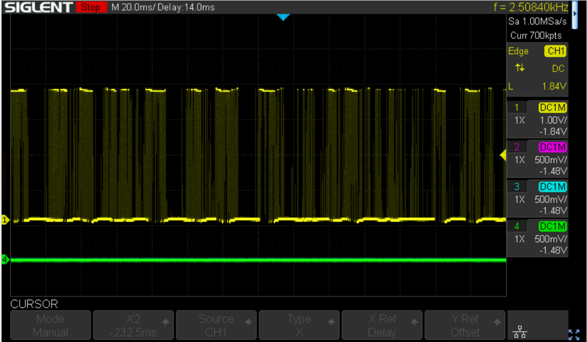
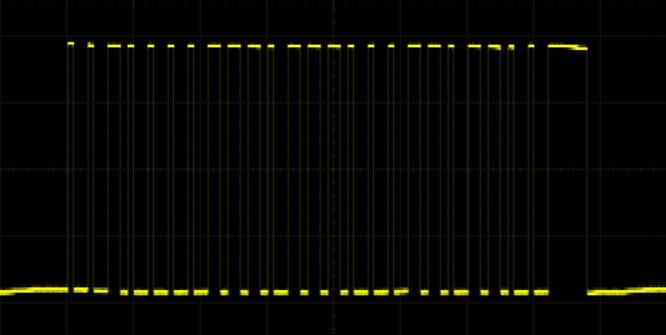
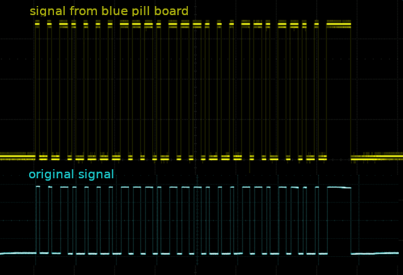
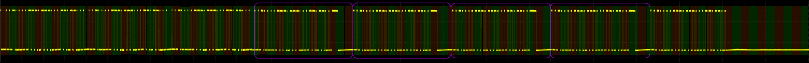
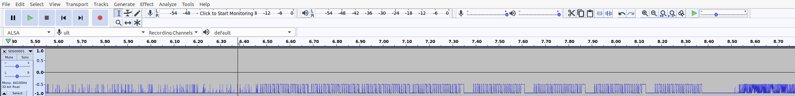
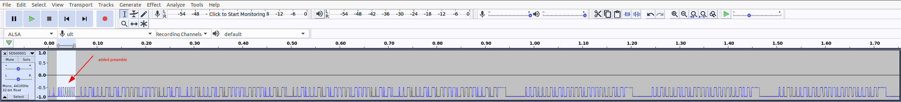
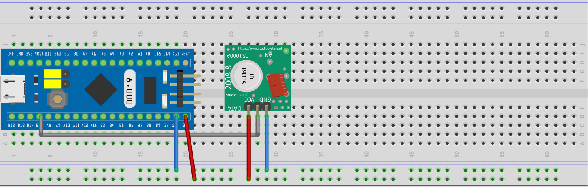

# Introduction

**Hint:** If you are only interested in the Rust code, simpy skip to section [the code](#The-Code).

Recently I've bought a set of power sockets at a German *Lidl* branch named *SilverCrest Funksteckdosen-Set* (IAN 32813_2001, produced by ROWI Germany GmbH) that can be controlled via a 433 MHz remote. 433 MHz is part of the [ISM band](https://en.wikipedia.org/wiki/ISM_band) which is reserved internationally for **i**ndustrial, **s**cientific and **m**edical purposes.

The set consists of 4 power sockets that go into learning mode the first 30 seconds after being plugged in. By pressing the *on* button of channel *A*, *B*, *C* or *D* on the remote control the socket is assigned to the respective channel. In that way it differs from the models that are described in some of the German blog posts, e.g. [ Hacking Intertec Funksteckdosen ](https://hartgeloetet.blogspot.com/2014/05/hacking-intertec-funksteckdosen.html) or [3 Wege zum Funksteckdosen hacken](https://itooktheredpill.irgendwo.org/2013/funksteckdosen-hacken/). Those sockets and remotes used DIP switches to encode/decode the individual channel and therefore a relation between the binary value of the DIP switches and the transmitted signal could be etsablished.

**NOTE:**  There is no communication outgoing from the socket itself. 

For decoding and later on sending of the bitstream I've ordered a cheap 433 MHz wireless transmitter and receiver module set.


# Decoding #

To decode the signal, I've connected an oscilloscope to the *RX* pin of the receiver. There is a lot of noise, when no button is pressed on the remote.



Probably the device uses some kind of automatic gain control and cranks up the input if there is no real input. Those cheap transmitter and receiver modules use a simple [OOK](https://en.wikipedia.org/wiki/On%E2%80%93off_keying) (on off keying) mechanism to transfer the data with the radio wave. [Communicating with 433MHz OOK/ASK wireless modules (#88)](https://www.youtube.com/watch?v=w6V9NyXwohI) is a (Arduino based) video that explains in fairly good details what's going on.

Nevertheless the signal can be recorded, when a button on the remote was pressed. As an example, here is an image of pressing the *on* button for channel *A*:



I am still wondering though why the long lasting sequences of low signals are not disturbed from noise if there is nothing beeing transmitted to signal a low value. Maybe it is not just *OOK* but also a combination with the simplest type of [ASK](https://en.wikipedia.org/wiki/Amplitude-shift_keying) (amplitude shift keying). While the Wikipedia article might be correct, the approach is too mathematical for my personal taste. Have a look at this image:


It is hosted on [this German website](https://www.elektroniktutor.de/signalkunde/ask.html) explaining ASK. The right side shows a waveform used for a simple ASK implementation utilizing two different amplitudes to represent high and low values.

So much for the physical characteristics of the transmitted signal. On top of that there could be used a [Manchester Encoding](https://en.wikipedia.org/wiki/Manchester_code) from the remote control which would give us the clock information. But there are quite long periods of low values in the signal, so that I don't think that this kind of encoding takes place. For a pure replay it doesn't matter anyway, since we must simply be able to create the same sequence of low and high values with a correct timing.

The signal seems to lack any kind of preamble, e.g. `10101010` or `01010101`, it cuts right to the chase.

After taking a screenshot of every signal from each button, here is a table with the binary decoded signals.

| Chn    | status | bitstream                                                                                   |
|:------:|:-------|:--------------------------------------------------------------------------------------------|
| A      | on     | `10010011 01001001 00100110 11011010 01101101 10100100 10011011 01001101 10100100 11111100` |
| A      | off    | `10010011 01001101 10110110 11011010 01001001 10100100 10010011 01001101 10100100 11111100` |
|        |        |                                                                                             |
| B      | on     | `10010011 01001101 00110100 10011010 01101001 10110110 10010011 01101001 10100110 11111100` |
| B      | off    | `10010011 01001001 10100100 11011011 01001001 10110100 11011010 01101001 10100110 11111100` |
|        |        |                                                                                             |
| C      | on     | `10010011 01001001 10100110 11010010 01101101 00100100 11010011 01101101 10110100 11111100` |
| C      | off    | `10010011 01001101 10100110 10010011 01001001 10100110 10011010 01101101 10110100 11111100` |
|        |        |                                                                                             |
| D      | on     | `10010011 01001101 00110110 10010011 01101101 10110100 10011010 01001001 10110110 11111100` |
| D      | off    | `10010011 01001101 10100100 11010011 01001101 00110110 11011011 01101001 10110110 11111100` |
|        |        |                                                                                             |
| Master | on     | `10010011 01001001 10110110 11011011 01101001 00110100 10011011 01101001 00110100 11111100` |
| Master | off    | `10010011 01001001 00100110 11011010 01101101 10100100 10011011 01001001 00110100 11111100` |


Each bit lasts 0.5 ms, therefore 2000 bits are transferred per second:

```
1 / 0.0005 = 2000
```

**NOTE:** the bit sequences are repeated as long as the button is pressed on the remote control.

Since the power sockets must be teached in a 30 second time window, I assume that every remote control has its own specific code, so that customers don't interfere, should they buy the same system. Lacking another remote control, I can't validate that. But my guess is, that most of the bits encode the serial number of the remote control and only some of them the action (switch on or off) and maybe some the version or brand of the system.


# Send the code, take 1

The plan was to send the code through an USB ttl converter to the 433 Mhz tranceiver. Finally this should be done with a small Rust program.


## Send the code, or how to fail

But first we need a proof of concept:

- I've inserted a power socket, paired it with the A channel and switched it off.
- Then I wrote the data for Channel *A* and status *on* to a binary file.
- Next I tried to write this data with `cat a-on.bin > /dev/ttyUSB0` to the tty device and stumbled:
  1. You cannot set a baudrate of 2000 with the `stty` command, the next fitting and accepted speed is `2400`.
  2. Stop bits cannot be disabled.

    Yes, of course. It is a serial terminal connection, I simply hoped that this could be overridden.
- Due to the wrong speed and the added stop bits the socket would not turn on.


## Send the code, take the blue pill and fail again

For the next try I used a [blue pill](https://stm32duinoforum.com/forum/wiki_subdomain/index_title_Blue_Pill.html) board and wrote a simple program to send the desired bit pattern. To spice things up, I decided to write the code in Rust. To set up the environment I followed [these instructions ](https://cgit.pinealservo.com/BluePill_Rust/resources/issues/1) well knowing of the existence of the [Rust embedded book](https://rust-embedded.github.io/book/).

- First I tried the *hello world" from the [Utah Rust Usergroup](https://cgit.pinealservo.com/BluePill_Rust/blue_pill_base), only to
  - learn that I need to [update](http://www.emcu.eu/how-to-update-the-st-link-fw-under-linux/) the firmware of the ST-Link V2 programmer.
  - Afterwards I could compile and flash the code and the LED on pc13 started to blink ten times in a slow pace.
- Then I [hard coded](./examples/bluepill-hardcoded-take1.rs) (can you say hardcodes?) the values to switch on a socket via channel *A* into the code and watched the result with an oscilloscope.
  - That looked promising:

    

  - After [wiring](#Wiring) up the transmitter I could sometimes successfully switch on the socket.
  
  But why only sometimes?
    - The bit sequence seems to be correct, maybe it is
    - the pause between the sequences? Playing around with them did not help very much. `10 ms` seemed to be the most successful variant.
    - the number of repetitions seems to be irrelevant, since it it changes when using the remote depending on how long the button is pressed.
    - it may be the amplitude of the signal but I doubt that, since the remote works even on a distance of a few meters with walls inbetween.
    - it may be the finnicky wiring of a bread board.
    - or it may be even the cheap transmitter.

After hooking up the oscilloscope to the receiver again, I learned that I just recorded and decoded a part of the signal. Here we go again...


# Decoding, take 2

Here is a full image of the *turn channel A on* sequence with the bytes marked in an alternating color:



Remarkable is the 4 time repetition of the part of the signal, I've already [decoded](#Decoding) during take 1. Since the complete sequence is repeated as long as the button is pressed on the remote, I mistook that part of the signal for the complete sequence. And it does not start on a byte boundary. I probably wouldn't have noticed the repeating pattern at all, if I did it right the first take. At least I saved some time decoding that part :-D


## Decoding, take 2, detour

Just when I was on the verge of decoding the singals again, I stumbled upon the [PulseView](https://sigrok.org/wiki/PulseView) project. So I exported the data from my oscilloscope as binary `wav` formatted file and tried to import that into *PulseView*, which did not work at all. A small detour using [Audacity](https://www.audacityteam.org/) made it possible nevertheless.

- Import the file as *raw data* into *Audacity*

  
- Cut away the noise at the beginning and the end
- Normalize
- Export a `wav` file
- Import into *PulseView*
- Add an *OOK* decoder and fail to decode. The decoder seems to look for a preamble to guess the timing of the signal.
- Add an artificial preamble the signal
  
- Cut away the noise at the beginning and the end
- Normalize
- Export a `wav` file
- Import into *PulseView*
- Add an *OOK* decoder and decode...
  

  ...again. Better than the last time but still not helpfull.
- Maybe I am just too inexperienced in using *PulseView*.
  
Anyway, back to doing it by hand.


## Decoding, take 2, do it by hand

Here is the result for the binary decoded signal.

| Chn    | status | bitstream                                                                 |
|:------:|:-------|:--------------------------------------------------------------------------|
| A      | on     | `10000100 10011010 01001001 00110110 11010011 01101101 00100100 11011010` |
|        |        | `01101101 00100100 00100100 11010010 01001001 10110110 10011011 01101001` |
|        |        | `11010011 01101001 00100001 00100110 10010010 01001101 10110100 11011011` |
|        |        | `01001001 00110110 10011011 01001001 00001001 00110100 10010010 01101101` |
|        |        | `10100110 11011010 01001001 10110100 11011010 01001111 11000000 00000000` |
|        |        | `10010011 01001001 00100110 11011010 01101101 10100100 10011011 01001101` |
|        |        | `10100100 11111100 00000000 00001001 00110100 10010010 01101101 10100110` |
|        |        | `11011010 01001001 10110100 11011010 01001111 11000000 00000000 10010011` |
|        |        | `01001001 00100110 11011010 01101101 10100100 10011011 01001101 10100100` |
|        |        | `11111100 00000000 00001001 00110100 10010010 01101101 10100110 11011010` |
|        |        | `01001001 10110100 11011010 01000000 00000000 00000000 00000000 00000000` |
|        |        | `00000000 00000000 00000000 00000000 00000000`                            |


# Send the code, take 2

Of course having just the static code to switch on a socket on channel *A* does not get me anywhere. The final step is [the code](#The-Code) in this repostory. The blue pill awaits the bytes to be send from the USB serial interface and shifts the bit values to GPIO pin `B15` to feed the transmitter.


# Wiring #

Wiring the blue pill board and the 433 MHz transmitter is very easy. Simply connect `3.3V` and `GND` of the blue pill and the transmitter board. Finally connret pin B15 of the blue pill board with the remaining pin of the transmitter.




# JSON config file #

**TODO**


# The code #


## The code - prerequisites ##

- You need
  - a blue pill board
  - a ST-Link V2 programmer
- setup your environment, as shown by [Utah Rust](https://cgit.pinealservo.com/BluePill_Rust/resources/issues/1), maybe have a look at the [Rust embedded Cortex M Quickstart manual](https://rust-embedded.github.io/cortex-m-quickstart/cortex_m_quickstart/).
- [update](http://www.emcu.eu/how-to-update-the-st-link-fw-under-linux/) the firmware of the ST-Link V2 programmer
- check if your ST-Link V2 programmer is known to the system via

  ```
  cargo flash --list-probes
  ```


## The code - build the blue pill part ##

- change to the directory `bluepill` and build/flash the code with
  
  ```
  cd <top directory of git repository>/bluepill
  cargo flash --release --chip STM32F103C8
  ```


## The code - build the cli tool ##

- [decode](#Decoding,-take-2,-do-it-by-hand) and write your own
- [JSON config file](#JSON-config-file),
  - remember the filename and directory or
  - copy it to `~/.etc/switch-433mhz-socket/config.json`
- change back to the main directory and build the tool with

  ```
  cd <top directory of git repository>
  cargo build --release
  ```
- use and/or copy the tool `target/release/switch-433mhz-socket`.

*Example call 1*

```
# use the default configuration file and turn channel A on
switch-433mhz-socket --action a-on
```

*Example call 2*

```
# provide a configuration file and switch channel B off
switch-433mhz-socket --config-file my-config-file.json --action b-off
```


# License #

Unless otherwise stated the code is licensed under the [MIT License](./MIT-License).